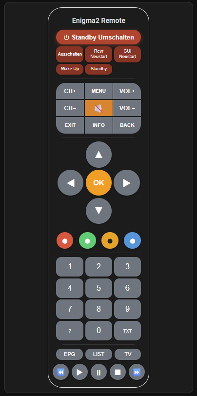
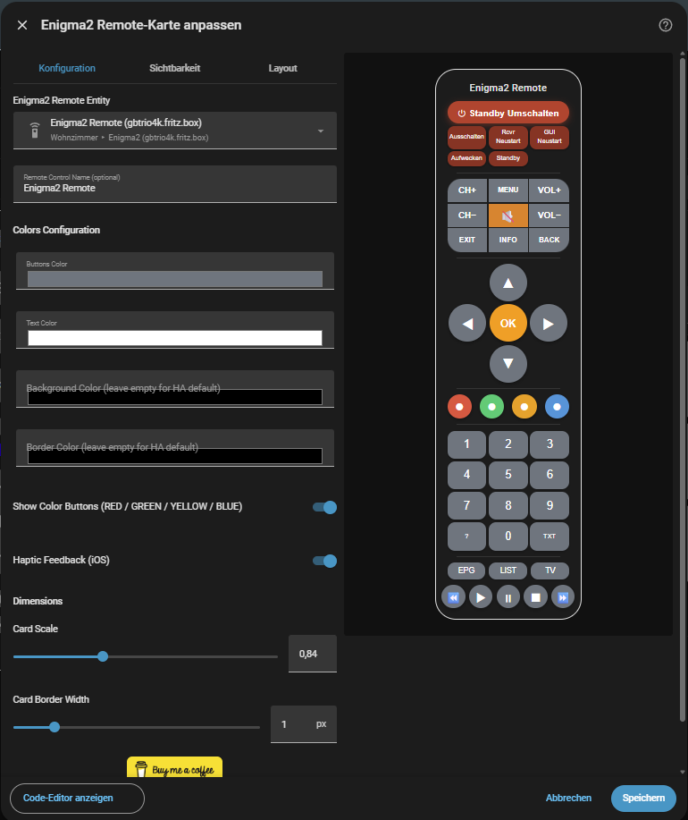

# Enigma2 Remote Control Integration for Home Assistant

[](https://github.com/hacs/integration)
[](https://github.com/gomble/enigma2-remote-hacs/releases)
[](LICENSE)

<a href="https://www.buymeacoffee.com/gomble" target="_blank">
  
</a>

A complete Home Assistant integration for controlling Enigma2 set-top boxes (e.g. Dreambox, VU+) via the OpenWebif API.

## ✨ Features

- 🎮 **Full Remote Control** — All essential buttons implemented
- 🖥️ **Modern Lovelace Card** — Beautiful, responsive design for all devices
- ⏻ **Power State Control** — All 6 OpenWebif power options (Standby Umschalten, Ausschalten, Receiver Neustart, GUI Neustart, Wake Up, Standby)
- ⚙️ **Config Flow** — Easy setup through the Home Assistant UI
- 🔘 **Long Key Presses** — Hold-function support (500 ms)
- 🌐 **OpenWebif API** — Uses the standard API, no additional software required
- 🔒 **HTTPS & Authentication** — Supports SSL/TLS and HTTP Basic Auth for secured OpenWebif setups
- 🌍 **Hostname Support** — Use hostnames (e.g. `receiver.fritz.box`) instead of IP addresses

## 📸 Preview



## 📋 Prerequisites

- Home Assistant 2023.1.0 or later
- Enigma2 set-top box with OpenWebif enabled
- Network connectivity between Home Assistant and the box

## 🚀 Installation

### Via HACS (recommended)

1. Open HACS in Home Assistant
2. Click **Integrations**
3. Click the three-dot menu (⋮) in the top-right corner
4. Select **Custom repositories**
5. Add the URL: `https://github.com/gomble/enigma2-remote-hacs`
6. Category: **Integration**
7. Click **Add**
8. Search for "Enigma2 Remote Control" and click **Download**
9. Restart Home Assistant

### Manual Installation

1. Download the latest version from [Releases](https://github.com/gomble/enigma2-remote-hacs/releases)
2. Extract the archive
3. Copy the folder `custom_components/enigma2_remote` to `<config>/custom_components/`
4. Restart Home Assistant

> The Lovelace card is automatically registered — no manual resource configuration needed.

## ⚙️ Configuration

### Adding the Integration

1. Go to **Settings** → **Devices & Services**
2. Click **+ Add Integration**
3. Search for "Enigma2 Remote Control"
4. Fill in the connection details (see table below)
5. Click **Submit**

The integration automatically creates a Remote entity named `remote.enigma2_remote_<ip_address>`.

#### Setup Fields

| Field | Description | Default |
|---|---|---|
| **IP Address or Hostname** | IP address (`192.168.1.100`) or hostname (`receiver.fritz.box`) | — |
| **Port** | OpenWebif port. Auto-switches to `443` when HTTPS is enabled | `80` |
| **Use HTTPS (SSL/TLS)** | Enable for secured OpenWebif setups. Self-signed certificates are accepted automatically. Enabling this auto-sets the port to `443`. | Off |
| **Username** | OpenWebif username — leave empty if no authentication is set up | — |
| **Password** | OpenWebif password — leave empty if no authentication is set up | — |

### Adding the Lovelace Card

The Lovelace card is **automatically registered** when the integration is installed via HACS. No manual resource configuration needed!

#### Via the UI (recommended)

1. Edit your dashboard
2. Click **+ Add Card**
3. Scroll down and select **Custom: Enigma2 Remote Card**
4. Configure the card:

```yaml
type: custom:enigma2-remote-card
entity: remote.enigma2_remote_192_168_1_100
name: Living Room TV
```

#### Manually (YAML)

Add the card to your dashboard:

```yaml
type: custom:enigma2-remote-card
entity: remote.enigma2_remote_192_168_1_100
name: My Enigma2 Box
```

## 🎮 Supported Keys

### Power State Commands
The integration supports all 6 OpenWebif power states via the `/api/powerstate` endpoint:

| Command | Description |
|---------|-------------|
| `POWER_STATE_0` | Standby Umschalten (Toggle Standby) |
| `POWER_STATE_1` | Ausschalten (Deep Standby / Shutdown) |
| `POWER_STATE_2` | Receiver neustarten (Reboot) |
| `POWER_STATE_3` | GUI neustarten (Restart GUI) |
| `POWER_STATE_4` | Wake Up |
| `POWER_STATE_5` | Standby |

### Number Keys
`0`, `1`, `2`, `3`, `4`, `5`, `6`, `7`, `8`, `9`

### Navigation
- **Arrow keys**: `KEY_UP`, `KEY_DOWN`, `KEY_LEFT`, `KEY_RIGHT`
- **OK**: `KEY_OK`
- **Menu**: `KEY_MENU`
- **Exit**: `KEY_EXIT`

### Color Keys
`KEY_RED`, `KEY_GREEN`, `KEY_YELLOW`, `KEY_BLUE`

### Channel Keys
- **Channel up**: `KEY_CHANNELUP`
- **Channel down**: `KEY_CHANNELDOWN`

### Additional Functions
- **Info**: `KEY_INFO`
- **EPG**: `KEY_EPG` (Electronic Program Guide)
- **PVR**: `KEY_PVR` (Recordings)
- **TV**: `KEY_TV`
- **Text**: `KEY_TEXT` (Teletext)
- **Help**: `KEY_HELP`

## 🤖 Usage in Automations

You can use the Remote entity in automations and scripts:

### Power State Control

```yaml
service: remote.send_command
target:
  entity_id: remote.enigma2_remote_192_168_1_100
data:
  command: POWER_STATE_0
```

### Key Press

```yaml
service: remote.send_command
target:
  entity_id: remote.enigma2_remote_192_168_1_100
data:
  command: KEY_CHANNELUP
```

### Long Key Presses

```yaml
service: remote.send_command
target:
  entity_id: remote.enigma2_remote_192_168_1_100
data:
  command: KEY_OK
  hold_secs: 1
```

### Multiple Keys in Sequence

```yaml
service: remote.send_command
target:
  entity_id: remote.enigma2_remote_192_168_1_100
data:
  command:
    - KEY_MENU
    - KEY_DOWN
    - KEY_DOWN
    - KEY_OK
```

## 📱 Screenshots

### Remote Control Card


### Visual Card Editor

The card comes with a **built-in visual editor** — no YAML editing required!



Open the editor by clicking the **pencil icon** on the card in your Lovelace dashboard.

#### Editor Options

| Setting | Description |
|---|---|
| **Enigma2 Remote Entity** | Native HA entity picker — only shows entities from this integration |
| **Remote Control Name** | Optional display title shown at the top of the card |
| **Buttons Color** | Color picker for all button backgrounds |
| **Text Color** | Color picker for button text/icons |
| **Background Color** | Color picker for the card background (leave empty for HA theme default) |
| **Border Color** | Color picker for the remote body border (leave empty for HA theme default) |
| **Show Color Buttons** | Toggle the RED / GREEN / YELLOW / BLUE color button row on or off |
| **Haptic Feedback (iOS)** | Enable native haptic feedback on button press via the HA Companion App |
| **Card Scale** | Resize the entire remote (0.5× – 1.5×, default 1.0) |
| **Card Border Width** | Width of the remote body border in px (0–6) |

All changes are applied instantly to the **live preview** on the right side of the editor.

For advanced options (e.g. custom CSS variables), switch to the **Code Editor** at the bottom of the dialog.

## 🔧 Troubleshooting

### Cannot Add the Integration

- Make sure OpenWebif is enabled on your Enigma2 box
- Verify the IP address and port
- Test the connection: `http://<ip>:<port>/api/about`

### Keys Are Not Working

- Check the logs in Home Assistant: **Settings** → **System** → **Logs**
- Ensure the box is reachable on the network
- Test the API directly: `http://<ip>:<port>/api/remotecontrol?command=103`

### Card Is Not Displayed

- Make sure the resource has been added
- Clear your browser cache (Ctrl+F5)
- Check the browser console for errors

## 🛠️ Development

### Project Structure

```
enigma2_remote/
├── custom_components/
│   └── enigma2_remote/
│       ├── __init__.py              # Integration setup
│       ├── manifest.json            # Integration manifest
│       ├── config_flow.py           # UI configuration flow
│       ├── remote.py                # Remote entity platform
│       ├── const.py                 # Constants
│       ├── icon.svg                 # Integration icon
│       ├── strings.json             # UI strings
│       ├── translations/
│       │   └── en.json              # English translations
│       └── www/
│           └── enigma2-remote-card.js  # Lovelace card (auto-registered)
├── screenshots/
│   └── card-preview.png             # Card preview screenshot
├── README.md                        # This file
├── hacs.json                        # HACS manifest
├── LICENSE                          # MIT License
└── info.md                          # HACS store description
```

### Local Testing

1. Clone the repository
2. Copy `custom_components/enigma2_remote` to `<ha_config>/custom_components/`
3. Copy `www/enigma2-remote-card.js` to `<ha_config>/www/`
4. Restart Home Assistant

## 📝 API Reference

The integration uses the OpenWebif API:

- **Key press**: `GET /api/remotecontrol?command=<code>`
- **Long key press**: `GET /api/remotecontrol?type=long&command=<code>`
- **Power state**: `GET /api/powerstate?newstate=<0-5>`

Key codes are defined in `const.py`.

## 🤝 Contributing

Contributions are welcome! Please:

1. Fork the repository
2. Create a feature branch (`git checkout -b feature/AmazingFeature`)
3. Commit your changes (`git commit -m 'Add some AmazingFeature'`)
4. Push to the branch (`git push origin feature/AmazingFeature`)
5. Open a Pull Request

## 📄 License

This project is licensed under the MIT License — see [LICENSE](LICENSE) for details.

## 🙏 Acknowledgments

- Home Assistant Community
- OpenWebif Developers
- Enigma2 Developers

## 📞 Support

For questions or issues:

- 🐛 [Create an Issue](https://github.com/gomble/enigma2-remote-hacs/issues)
- 💬 [Discussions](https://github.com/gomble/enigma2-remote-hacs/discussions)

## ☕ Buy Me a Coffee

If you find this integration useful, consider supporting its development:

<a href="https://www.buymeacoffee.com/gomble" target="_blank">
  
</a>
